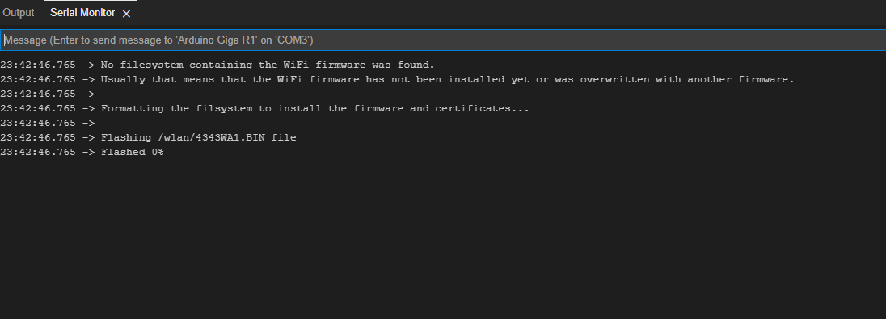
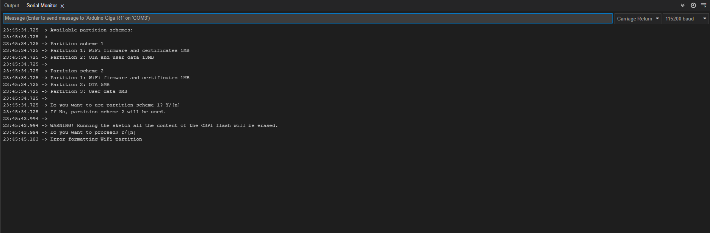
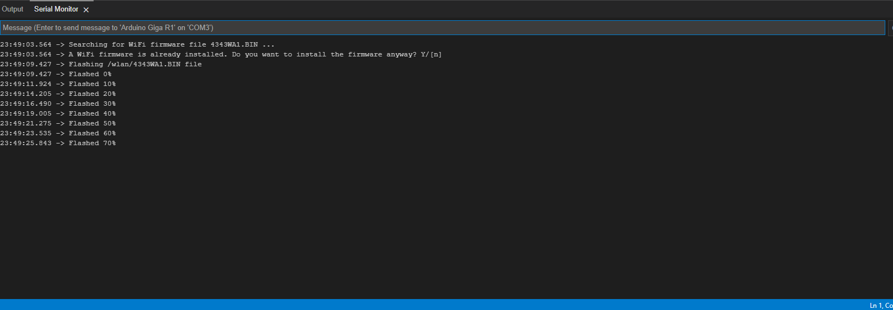
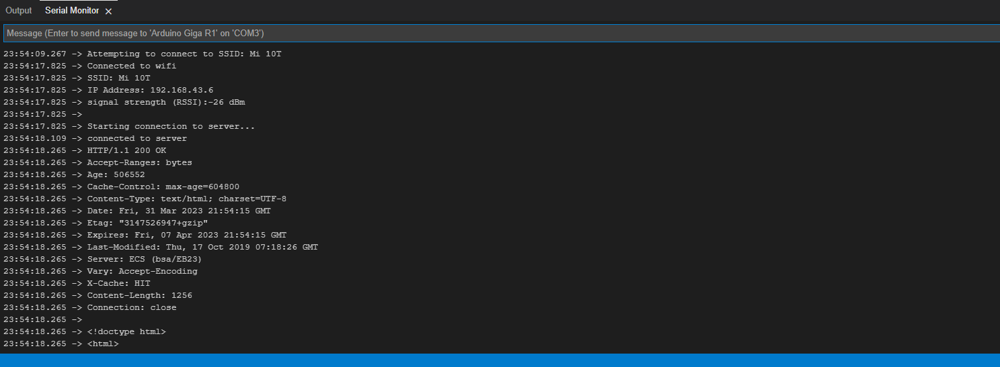

# GigaWiFiSolver
if you encountered an issue of enabling WiFi of Arduino Giga R1 WiFi maybe this library can help you

##
# Warning: don't use this library unless you couldn't use WiFiFirmwareUpdater that comes with Arduino Giga R1 WiFi Package
##

# History
I bought An Arduino Giga R1 WiFi board, in first glance it looks good and powerful, but for some reasons I coudn't able to run  wifi, it tells me there's a missing firmware.



So I tried to use WiFiFirmwareUpdate but it failed also, so I thought there's something wrong with a Flash layout, thus I decided 
to use QSPIFormat sketch and gives me this error 



After a Whole week of debugging and trying to understand the issue, I found out that I can't use the QSPI Flash properly, as it turned out there's an issue in reading data from the Flash. 
Arduino Giga uses AT25SF128A 16Mb Nor Flash and it supports Quad Mode.

The QSPIFBlockDevice uses an Quad I/O Fast Read Instruction for reading data from the Flash, but if you use QSPIFBlockDevice directly you cannot read the data as the ```read``` function has issue.

<span>
**-** **the issue is related to Arduing Giga R1 that comes with AT25SF128A**.
<span>
**-** **Sadly you can't use the external Flash Until the Arduino Fix the issue or use this library and it's compitable with mbed and Arduino api**.

# Solution
I created a handy quick solution by creating a modified QSPIFBlockDevice and called it QSPIFBlockDeviceASAS, it's same as QSPIFBlockDevice except it uses different implementation of reading function.

# Steps to Enable WiFi

### 1 - Use WiFiFirmwareUpdater provided with this library to install the firmware

### 2 - Include ``` #include <GigaWiFiSolver.h> ``` before ``` #include <WiFi.h> ``` look for WiFi example

I hope this library can help you, in case you have problem or anything you can contact me.
[my twitter](https://twitter.com/da_lambda)